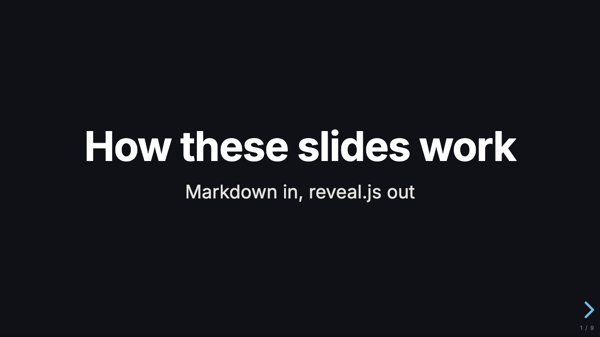
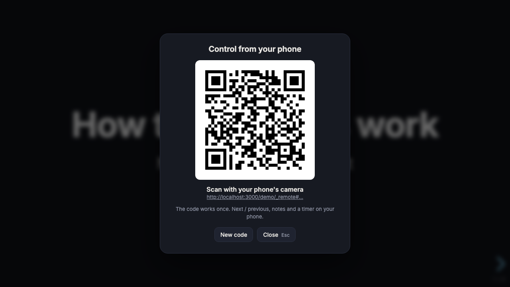
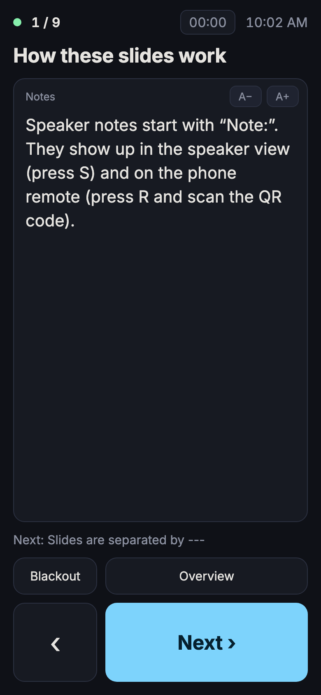
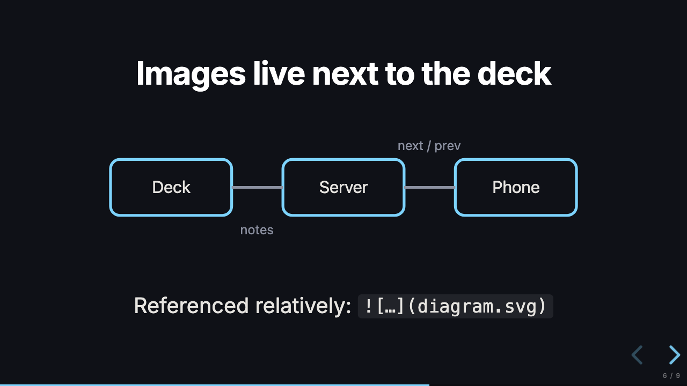

<div align="center">

# Slides

**Self-hosted reveal.js presentations you open from any browser, with a code.**

[](https://github.com/andersro93/slides/actions/workflows/release.yml)
[](https://github.com/andersro93/slides/releases/latest)
[](https://github.com/andersro93/slides/pkgs/container/slides)
[](apps/server/go.mod)
[](https://scorecard.dev/viewer/?uri=github.com/andersro93/slides)
[](LICENSE)



</div>

Walk into any meeting room, open your Slides server, type the
presentation's code, and present. Nothing to install, no USB stick, no
logging in on someone else's laptop.

- **One text field.** The landing page is a single input. The code *is* the
  access: there is no listing of presentations anywhere, and wrong guesses
  are rate-limited.
- **reveal.js underneath.** Presentations are Markdown or reveal.js HTML
  ([authoring guide](docs/authoring.md)), with speaker notes, fragments, code
  highlighting, themes and PDF export.
- **Content lives outside the image.** The presentations are a folder you
  mount (plain directory, or a private git repo via git-sync). New and edited
  decks go live within seconds, no release or restart. A deck that breaks
  keeps serving its last good version.
- **Your phone is the clicker.** Press **R** on the deck, scan the QR code,
  and your phone shows next/previous, your speaker notes, the next slide and
  a timer. The QR is single-use, so someone photographing the projector gets
  nothing.
- **One small image.** A static Go binary with the frontend embedded
  (`go:embed`), on distroless: about 6 MB, amd64 and arm64. No database,
  nothing to write.

<table>
  <tr>
    <td width="62%"></td>
    <td width="38%" rowspan="2"></td>
  </tr>
  <tr>
    <td></td>
  </tr>
</table>

## Quick start

You need Docker. Make a presentations folder with one deck in it:

```sh
mkdir -p presentations/hello
cat > presentations/hello/index.md <<'MD'
---
code: hello
title: Hello
---

# Hello, world

---

## A second slide

Note:
Speaker notes: only you see these.
MD
```

Run the server with the folder mounted read-only at `/decks`:

```sh
docker run --rm -p 3000:3000 -v ./presentations:/decks:ro ghcr.io/andersro93/slides
```

Open <http://localhost:3000>, type `hello`, and you're presenting. Edit the
file and reload: the change is live within seconds. Add `-e DEV=1` while
writing, and an open deck reloads itself on every save.

From here:

- The [authoring guide](docs/authoring.md) covers frontmatter, themes,
  Markdown and HTML decks, images, the phone remote, PDF export and
  troubleshooting. [`examples/`](examples) has a Markdown and an HTML demo
  deck, plus a template to copy.
- [Deploying](#deploying) covers running it for real.

## Deploying

The image is `ghcr.io/andersro93/slides`, tagged `latest`, `X`, `X.Y` and
`X.Y.Z`. It needs nothing but the presentations folder mounted at `/decks`;
without a mount it refuses to start.

[`deploy/compose.yaml`](deploy/compose.yaml) is a complete example that runs it
behind [Cloudflare Tunnel](https://developers.cloudflare.com/cloudflare-one/connections/connect-networks/),
with the presentations either as a folder on the host or as a private git
repository kept in sync by git-sync. Any reverse proxy that passes WebSockets
through works just as well.

| Env | Default | |
| --- | --- | --- |
| `DECKS_DIR` | `/decks` (image) | The presentations folder. Watched; `SIGHUP` forces a rescan. |
| `RELOAD_INTERVAL` | `5s` (`1s` with `DEV`) | How often the folder is checked for changes |
| `CLIENT_IP_HEADER` | *(peer address)* | Header holding the real client IP, e.g. `CF-Connecting-IP` behind Cloudflare. Only set it when the proxy is the only way in. |
| `PORT` | `3000` | |
| `DEV` | off | Authoring: serve `draft: true` decks, open decks reload themselves, an unknown code shows the load errors |
| `APP_DIR` | *(embedded)* | Serve the frontend from disk (frontend development) |

Check a presentations folder before it goes live, for example in the content
repository's CI:

```sh
docker run --rm -v "$PWD:/decks:ro" ghcr.io/andersro93/slides validate
```

The binary is its own healthcheck client (`slides healthcheck`, wired into
the image's `HEALTHCHECK`); `GET /healthz` works from outside.

## Security model

- The code is the only credential; anyone with it sees the deck. Private
  decks need `private: true` and a ≥ 12-character code. After 30 misses in 10
  minutes a client gets 429 on every deck route, including valid codes.
- Everything is `noindex`, `robots.txt` disallows all, `Referrer-Policy:
  no-referrer` keeps codes out of other sites' logs, and deck files are
  `Cache-Control: private`.
- The image contains no presentations, so it is not sensitive; the mounted
  folder (or its git repository) is. The server only follows plain files:
  symlinks inside the folder are refused, so it cannot be tricked into
  serving anything from outside it.
- Remote pairing: the QR token is single-use; the paired phone gets its own
  key for reconnecting; the deck holds a separate host key. The server only
  relays `cmd` from phone to deck and `state` from deck to phone. Anyone with
  a code can run a host session, so the phone treats notes as untrusted
  (DOMPurify, and a remote-page CSP without inline script), and sessions are
  capped per client (8) and overall (256); abandoned unpaired sessions expire
  after 2 minutes. Sessions live in memory, so a restart means scanning again.
- Rate limiting keys on the IPv4 address or the IPv6 /64.

Found a hole? Please report it privately; see [SECURITY.md](SECURITY.md).

## Working on it

Toolchain via [mise](https://mise.jdx.dev): `mise install`, then `bun install`.

| | |
| --- | --- |
| `mise run dev` | Server on :3000 for `DECKS_DIR` (default `examples/`); a saved edit reloads the open deck, drafts are served |
| `mise run validate [dir]` | Check a presentations folder (default `examples/`) |
| `mise run test` | Go (with `-race`) and frontend unit tests |
| `mise run check` | Biome, TypeScript, golangci-lint, GoReleaser config |
| `mise run e2e` | Playwright against a local server and `e2e/fixtures` |
| `mise run artifacts` | `dist/server/linux/{amd64,arm64}/slides`, frontend embedded |
| `mise run image` | Multi-arch image via buildx |

Single-arch local image: `mise run artifacts && docker build -t slides:dev .`

Author against your real presentations with
`DECKS_DIR=~/code/presentations mise run dev`.

### Layout

```
apps/server/     Go: cmd/slides (serve | validate | list | healthcheck | version)
  internal/decks     frontmatter parsing, validation, the watched Source
  internal/web       routes, headers, per-client miss limiter
  internal/remote    phone-remote pairing and relay (WebSockets)
  internal/embedded  go:embed of the built frontend
apps/frontend/   Vite + TypeScript, no framework: landing, deck, remote
examples/        two demo decks (Markdown, HTML) for `mise run dev`
docs/            authoring guide
e2e/             Playwright + its fixture decks (also the CI smoke test's)
deploy/          compose example: Cloudflare Tunnel, folder or git-sync
```

### Routes

| | |
| --- | --- |
| `/` | the code field |
| `/<code>/` | the deck |
| `/<code>/_remote` | the phone remote |
| `/<code>/_ws` | remote WebSocket |
| `/<code>/<file>` | files from the deck's directory (never its `index.*`) |
| `/_app/…` | hashed frontend assets, cached immutable |
| `/healthz`, `/robots.txt` | |

### Releases

[Conventional Commits](https://www.conventionalcommits.org) drive
[svu](https://github.com/caarlos0/svu). A PR builds, smoke-tests,
browser-tests and pushes a preview image (`0.3.0-pr.12`); **merging to main
releases**: a tag, a GitHub Release with changelog, and
`ghcr.io/andersro93/slides:{version,major.minor,major,latest}` for
amd64 + arm64. Presentations are not part of this cycle at all.

## Contributing

Issues and pull requests are welcome. [CONTRIBUTING.md](CONTRIBUTING.md) covers
the setup, the checks, and the PR-title convention that drives releases.

## License

[MIT](LICENSE). The image bundles reveal.js, DOMPurify, uqr, the Inter font
and two Go libraries under their own licenses; see
[THIRD_PARTY_NOTICES.md](THIRD_PARTY_NOTICES.md).
