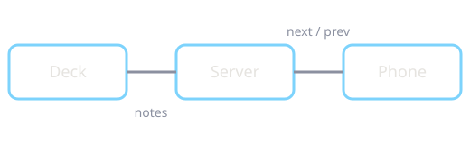

# How these slides work

Markdown in, reveal.js out

Note:
Speaker notes start with "Note:". They show up in the speaker view (press S)
and on the phone remote (press R and scan the QR code).

---

## Slides are separated by `---`

- A line with only `---` starts a new slide
- A line with only `--` starts a *vertical* one below it
- `Note:` starts the speaker notes

--

### This is a vertical slide

Press ↓ to get here, ↑ to go back.

---

## Fragments

- Appear one at a time <!-- .element: class="fragment" -->
- Like this <!-- .element: class="fragment" -->
- And this <!-- .element: class="fragment" -->

---

## Code

```go [1-2|4-6]
// Line highlights step through with the arrow keys.
package main

func main() {
	println("hello from the slides")
}
```

---

## Images live next to the deck



Referenced relatively: ``

---

<!-- .slide: data-background-color="#f7f7f5" -->

## Per-slide backgrounds

`<!-- .slide: data-background-color="#f7f7f5" -->`

---

## Keys worth knowing

| Key | Does |
| --- | --- |
| **R** | Control from your phone |
| **S** | Speaker view |
| **F** | Fullscreen |
| **O** / Esc | Overview |
| **B** | Blackout |
| **?** | All shortcuts |

---

# Thanks!

Add `?print-pdf` to the URL and print for a PDF.
